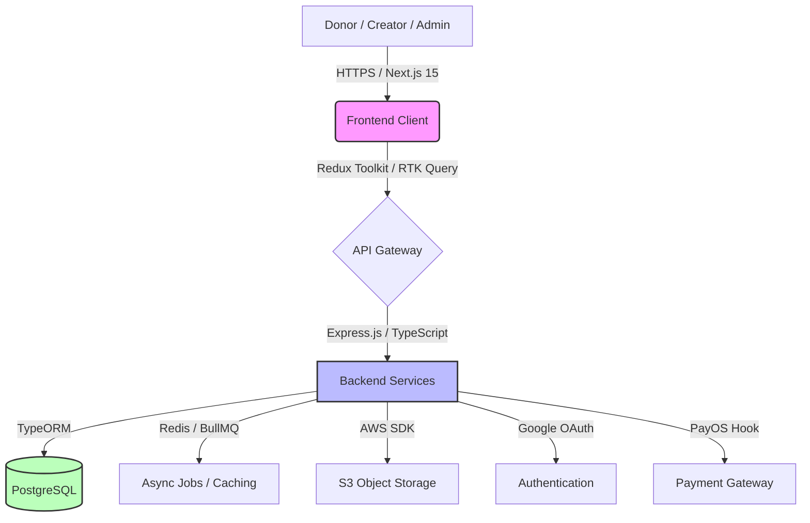

# 💖 SCharity - Transparent Crowdfunding Platform

<div align="center">


[](https://nextjs.org/)
[](https://www.typescriptlang.org/)
[](https://tailwindcss.com/)
[](https://expressjs.com/)
[](https://www.postgresql.org/)

**Nền tảng gây quỹ từ thiện minh bạch và uy tín hàng đầu tại Việt Nam**

[Features](#-key-features) • [Architecture](#-system-architecture) • [Tech Stack](#-technical-stack) • [Quick Start](#-getting-started)

</div>

---

## 📖 About SCharity

**SCharity** là một giải pháp công nghệ toàn diện nhằm kết nối các nhà hảo tâm (Donor) với những dự án cộng đồng ý nghĩa. Platform ưu tiên tính **Minh bạch (Transparency)** và **Tin cậy (Trust)** thông qua quy trình định danh eKYC, báo cáo tiến độ bằng hình ảnh/video trực tiếp và hệ thống quản trị dòng tiền chặt chẽ.

---

## ✨ Key Features

### 👨‍💼 Admin Management
- **Intelligent Dashboard**: Thống kê thời gian thực về dòng tiền, số lượng người dùng và hiệu suất chiến dịch.
- **Campaign Verification**: Quy trình duyệt chiến dịch nghiêm ngặt dựa trên hồ sơ chứng minh.
- **Financial Control**: Quản lý và phê duyệt các lệnh giải ngân (Withdrawal) đảm bảo tiền đến đúng nơi.
- **Project Oversight**: Công cụ can thiệp khẩn cấp (Suspend/Terminate) đối với các dự án có dấu hiệu trục lợi.

### 📋 Campaign Creator
- **Professional Storytelling**: Công cụ tạo chiến dịch với trình soạn thảo Rich-text, tải ảnh/video minh họa.
- **Real-time Progress Recording**: Đăng tải cập nhật (Timeline) để nhà tài trợ theo dõi quá trình thực hiện dự án.
- **Fund Management**: Yêu cầu rút tiền theo từng giai đoạn (50%, 100%) và tra cứu Analytics chuyên sâu.

### 🤝 Donor & Guest
- **Seamless Donation**: Hỗ trợ quyên góp qua cổng thanh toán hiện đại (PayOS), linh hoạt chọn Ẩn danh/Công khai.
- **Verified Discovery**: Khám phá danh sách dự án đa dạng, được phân loại và kiểm định rõ ràng.
- **Interaction**: Gửi lời chúc, bình luận động viên trực tiếp vào trang chi tiết chiến dịch.

---

## 🏗️ System Architecture



---

## 🛠️ Technical Stack

### Frontend (SCharity_FE)
- **Framework**: Next.js 15 (App Router), React 19
- **State Management**: Redux Toolkit & RTK Query
- **Styling**: Tailwind CSS & Framer Motion (Animations)
- **UI Components**: Shadcn UI, Radix UI, Lucide Icons
- **Forms & Validation**: React Hook Form, Zod

### Backend (SCharity_BE)
- **Core**: Node.js, Express.js (TypeScript)
- **Database**: PostgreSQL with TypeORM
- **Infrastructure**: Redis (Cache), BullMQ (Queue processing)
- **Storage**: AWS S3 (Images & Documents)
- **Monitoring**: Morgan, Swagger UI

### Services & Tools
- **Payment**: PayOS Integration
- **Auth**: Google OAuth 2.0, JWT, Passport.js
- **DevOps**: Docker, Docker Compose, Nginx

---

## 🚀 Getting Started

### Prerequisites
- Node.js 20+
- Docker & Docker Compose
- Google Client ID & PayOS API Keys

### Installation

1. **Clone the repository**
   ```bash
   git clone https://github.com/SCharityFU/SCharity.git
   cd SCharity
   ```

2. **Backend Setup**
   ```bash
   cd SCharity_BE
   cp .env.example .env
   npm install
   npm run dev
   ```

3. **Frontend Setup**
   ```bash
   cd ../SCharity_FE
   cp .env.example .env.local
   npm install
   npm run dev
   ```

Ứng dụng sẽ khả dụng tại:
- Frontend: `http://localhost:3001`
- Backend API: `http://localhost:5000/api`
- API Docs: `http://localhost:5000/api-docs`

---

## 🤝 Contributing & License

Project này được phát triển bởi đội ngũ SCharity. Mọi đóng góp xin vui lòng gửi Pull Request hoặc báo cáo Issue.

Distributed under the **MIT License**.

---

<div align="center">
  <sub>Built with ❤️ for a better community.</sub>
</div>
